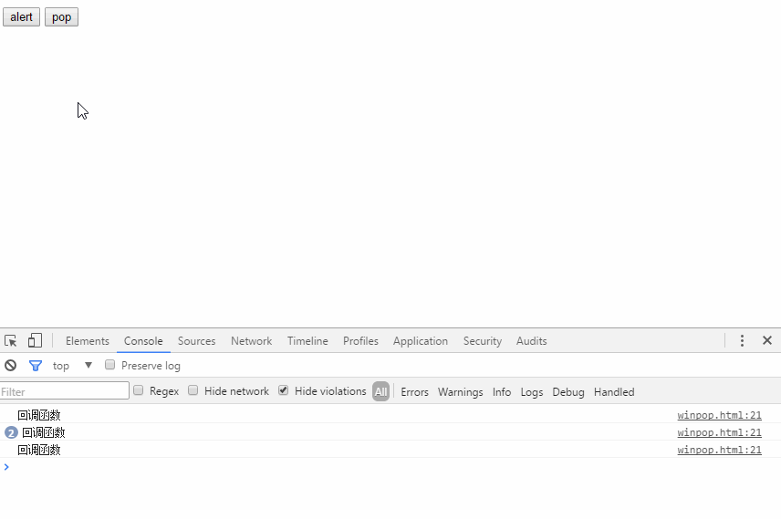

##### A simple pop-up box component


>使用方法：语法 new winpop(opt,function(){})
```javascript
//例：
var win = new winpop({
    headercon:'提示',
    popdes:'请谨慎操作？'
},function(){
    console.log("回调函数");
});
var btn=document.getElementById("open");

    btn.addEventListener('click',function(){
        win.alertpop();
    })
    $("#alert").on('click',function(){
        win.confimpop();
    })
```
